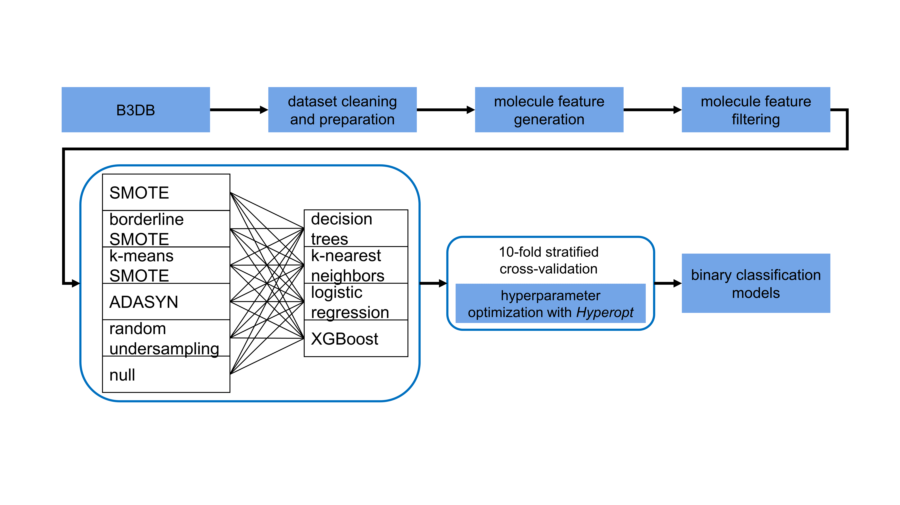
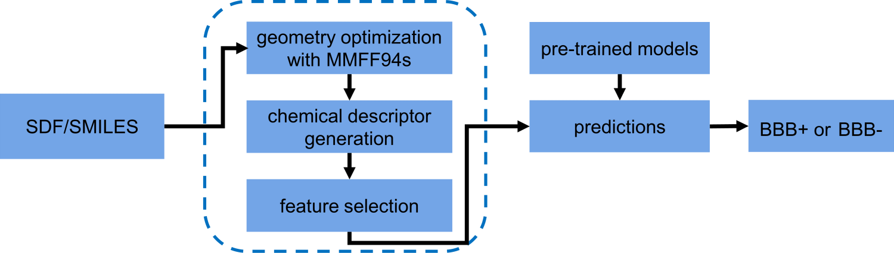

# B3clf

## About

The blood-brain barrier (BBB) protects and regulations the microvasculature in the central nervous system (CNS)
by inhibiting the transportation or passage of toxins and pathogens from the blood. Because of its resistance to
exogenous compounds, the BBB also poses a challenge for the
delivery of neuroactive molecules (i.e. drugs) into the CNS.
Understanding small molecules' BBB permeability is therefore vital for CNS drug discovery, and should
be considered at an early stage in the drug-development pipeline to avoid costly late-stage failures.

`B3clf` uses data from 7407 molecules, taken from our curated dataset,
[B3DB](https://github.com/theochem/B3DB). It supports
24 different models, with four different classification algorithms (_dtree_ for decision
trees, _logreg_ for logistical regression, _knn_ for KNN, _xgb_ for XGBoost) and six resampling
strategies (_classic_RandUndersampling_, _classic_SMOTE_, _borderline_SMOTE_, _k-means_SMOTE_, _classic_ADASYN_,
and _common_ for no resampling), as shown below.



The workflow of `B3clf` is summarized in the following diagram:


The output is the molecule name/ID, the predicted probability, and the BBB
permeability label. The predicted probability makes it easy to benchmark our models, enabling
calculations of ROC, precision-recall curves, _etc._. `b3clf` has been tested on Windows 10,
Linux and MacOS.

## Installation

It is recommended to work with a virtual environment with `Python >=3.7`. Here is the code
snippet that can be used to install our package.

```bash
# create a virtual environment with conda
conda create -y -n b3clf_py37 python=3.7
# or
# conda env create --file environment.yml
conda activate b3clf_py37

# download B3clf
git clone git@github.com:theochem/B3clf.git
cd B3clf

# install rdkit
conda install -c rdkit rdkit>=2020.09.1.0
# install other dependencies
# pip install -r requirements.txt
# or with
# conda install --file requirements_conda.txt

# install B3clf package
pip install .
```

Last but not least, Java 6+ is required in order to compute chemical descriptors with
[`padelpy`](https://github.com/ecrl/padelpy) which is a python wrapper of
[`Padel`](http://www.yapcwsoft.com/dd/padeldescriptor/).

## Usage

### Getting Help

Once can easily get the help document from `bash` with

```bash
b3clf --help
```

which prints out,

```
usage: b3clf [-h] [-mol MOL] [-sep SEP] [-clf CLF] [-sampling SAMPLING]
             [-output OUTPUT] [-verbose VERBOSE]
             [-keep_features KEEP_FEATURES] [-keep_sdf KEEP_SDF]

b3clf predicts if molecules can pass blood-brain barrier with resampling
strategies.

optional arguments:
  -h, --help            show this help message and exit
  -mol MOL              Input file with descriptors.
  -sep SEP              Separator for input file. Default="\s+|\t+".
  -clf CLF              Classification algorithm type. Default=xgb.
  -sampling SAMPLING    Resampling method type. Default=classic_ADASYN.
  -output OUTPUT        Name of output file, CSV or XLSX format.
                        Default=B3clf_output.xlsx.
  -verbose VERBOSE      If verbose is not zero, B3clf will print out the
                        predictions. Default=1.
  -keep_features KEEP_FEATURES
                        To keep computed feature file ("yes") or not ("no").
                        Default=no.
  -keep_sdf KEEP_SDF    To keep computed molecular geometries ("yes") or not
                        ("no"). Default=no.
```

In `Python`, it is also doable with

```python
from b3clf import b3clf

b3clf?
```

There are two ways to use `B3clf` for BBB predictions, as a command-line (CLI) tool and as a Python
package.

### Command Line Interface (CLI) of `B3clf`

Now `B3clf` supports SMILES and SDF text files. Three example files are provided in the
[test](b3clf/test) sub-folder. A simple usage example is:

```bash
b3clf -mol test_input_sdf.sdf -clf xgb -sampling classic_ADASYN -output test_SMILES_pred.xlsx -verbose 1
```

which outputs

|   | ID             | B3clf_predicted_probability | B3clf_predicted_label |
| - | -------------- | --------------------------- | --------------------- |
| 0 | H1_Bepotastine | 0.142235                    | 0                     |
| 1 | H1_Quifenadine | 0.981108                    | 1                     |
| 2 | H1_Rupatadine  | 0.967724                    | 1                     |

## Citation

Please use the following citation in any publication using *B3clf*:

```md
Fanwang Meng, et al, Blood-Brain Barrier Permeability Predictions of
Organic Molecules with XGBoost and Resampling Strategies, Journal, page, volume, year, doi.
```
The *B3DB* database is an essential ingredient in *B3clf*:
```md
@article{Meng_A_curated_diverse_2021,
author = {Meng, Fanwang and Xi, Yang and Huang, Jinfeng and Ayers, Paul W.},
doi = {10.1038/s41597-021-01069-5},
journal = {Scientific Data},
number = {289},
title = {A curated diverse molecular database of blood-brain barrier permeability with chemical descriptors},
volume = {8},
year = {2021},
url = {https://www.nature.com/articles/s41597-021-01069-5},
publisher = {Springer Nature}
}
```

## Contributing and Q&A

For any suggestions or questions, post questions in
[GitHub Discussion Board](https://github.com/theochem/B3clf/discussions).

### _ToDo_

- [ ] Add link to manuscript
- [ ] Add CITATION.cff once manuscript is published
- [ ] Add environment.yml for conda to install everything in one step
